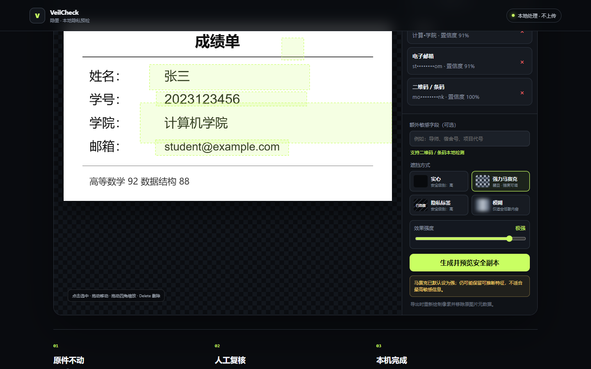
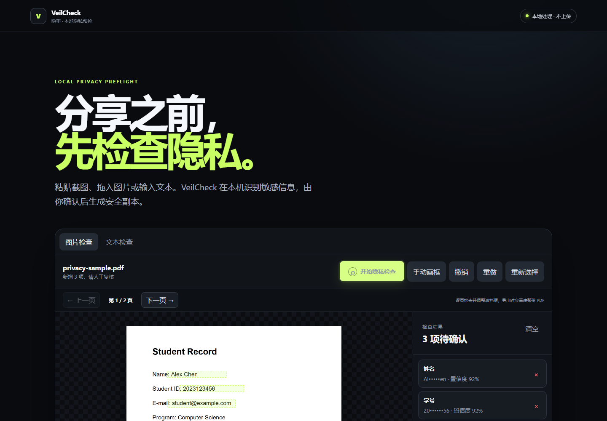

# VeilCheck 隐墨

**把成绩单、截图或 PDF 发给别人之前，先看看里面有没有不该发出去的东西。**

VeilCheck 是一个在你自己电脑上运行的隐私检查工具。把图片或 PDF 放进去，它会尝试找出姓名、手机号、邮箱、身份证、地址等敏感内容。你可以检查和调整遮挡框，确认预览没有问题后，再下载一份新的安全副本。

它不会替你做最后决定，也不会承诺“百分之百没有遗漏”。它做的是把最容易忘记、又最容易出事的分享前检查，变成一个清楚、可复核的流程。



## 它能做什么

- 检查 PNG、JPG、WEBP 和多页 PDF
- 在本地进行中英文 OCR，不把文件上传到云端
- 识别手机号、邮箱、身份证、银行卡、IP、JWT 和常见 API Key
- 根据“姓名、学号、地址、学院、专业、工号”等字段找到旁边的内容
- 允许添加“导师、宿舍号、项目代号”等自定义字段
- 自动结果不准时，可以手动画框，也可以移动、缩放、删除、撤销和重做
- 提供实心遮挡、隐私标签、马赛克和模糊四种处理方式
- 先看安全副本预览，再决定是否下载
- 对处理后的副本再做一次 OCR，提醒你可能仍有遗漏
- 导出一份不包含原始敏感值的 JSON 检查报告

PDF 不是简单地在原页面上盖一块黑色。VeilCheck 会把每一页重新绘制并生成一份新 PDF，原来的文字层、批注、表单和元数据不会被复制过去。



## 三分钟开始使用

需要先安装 [Node.js 20 或更新版本](https://nodejs.org/) 和 [pnpm](https://pnpm.io/installation)。

下载源码或克隆仓库后，进入项目目录：

```bash
cd veilcheck
pnpm install
pnpm start
```

然后打开 `http://127.0.0.1:4173`。

Windows 用户安装依赖后，也可以直接双击 `Start-VeilCheck.cmd`。

### 实际使用流程

1. 拖入一张图片或一个 PDF。
2. 点击“开始隐私检查”。PDF 需要逐页检查。
3. 看一遍自动结果，遗漏的地方手动画框，不准确的框可以移动或缩放。
4. 选择遮挡方式，生成预览；高敏信息优先用“实心”或“隐私标签”。
5. 需要更放心时，再点一次“再次检查安全性”，最后下载副本。

原文件不会被覆盖。建议保留原件，只分享文件名带有 `.veilcheck` 的副本。

## 为什么强调“本地”

隐私检查工具本身不应该成为新的隐私风险。VeilCheck 的页面、OCR 语言数据、PDF 解析器和导出逻辑都由本地服务提供。正常使用不需要账号、云端 API 或遥测服务。

你可以断网后启动并使用它。浏览器只会访问本机的 `127.0.0.1`。

## 遮挡方式怎么选

| 方式 | 适合场景 | 提醒 |
| --- | --- | --- |
| 实心遮挡 | 身份证、账号、密码等高敏信息 | 推荐，导出前会检查像素是否完整覆盖 |
| 隐私标签 | 希望别人一眼知道这里被主动隐藏 | 同样使用不透明底层，安全级别高 |
| 强力马赛克 | 普通截图、强调视觉效果 | 仍可能泄露长度、轮廓或局部特征 |
| 模糊 | 低敏内容、临时预览 | 不适合身份证、账号等高敏内容 |

## 目前做不到什么

- 自动检测会漏报，也会误报；分享前仍然需要人看一遍
- 手写文字、严重模糊、旋转或被裁切的内容可能识别失败
- 二维码自动检测取决于浏览器是否支持 `BarcodeDetector`
- 加密 PDF 暂不支持
- 安全 PDF 会失去搜索、复制、链接、表单和无障碍语义，并可能比原文件更大
- Word、Excel、PPT 和视频还没有接入
- 本项目不是法律、合规或认证工具

如果二次复检仍然提示问题，不一定代表内容真的泄露，也可能是字段标签引起的保守提醒。请回到对应页面检查预览，并扩大遮挡框。

## 开发与测试

```bash
pnpm check
pnpm test
pnpm benchmark
```

当前仓库包含：

- 11 项检测与脱敏单元测试
- 28 条合成隐私基准
- 合成中文成绩单和两页 PDF 测试文件
- 图片与 PDF 的真实浏览器回归脚本（位于项目外的开发工作区，不进入发布包）

测试数据都是人工合成的，不对应真实人物。数据策略见 [tests/DATASETS.md](tests/DATASETS.md)。合成测试通过并不等于真实世界准确率达到 100%。

## 项目结构

```text
src/                 检测规则和浏览器交互
tests/               单元测试、基准与合成样本
scripts/             基准运行脚本
vendor/              本地 OCR 语言数据和 PDF 运行文件
server.mjs           只监听 127.0.0.1 的静态服务
Start-VeilCheck.cmd  Windows 快速启动脚本
```

PDF.js 使用 Apache-2.0 许可证，pdf-lib 使用 MIT 许可证，具体说明见 [THIRD_PARTY_NOTICES.md](THIRD_PARTY_NOTICES.md)。

## 参与项目

欢迎提交问题、识别失败的合成样例和改进建议。请不要在 Issue 里上传真实身份信息、聊天记录或任何含个人信息的文件。详细说明见 [CONTRIBUTING.md](CONTRIBUTING.md) 和 [SECURITY.md](SECURITY.md)。

接下来优先考虑 Word 文档检查、批量处理、人脸和车牌识别，以及更可靠的中文姓名与地址模型。

## License

[MIT](LICENSE)
